

    <h3 align = center><u>COMPTE-RENDU DE STAGE - 1ÈRE ANNÉE - BTS SIO OPTION SLAM
    </h3></u> 
    <h4>Mouaz MOHAMED
    </h4>
    <h5>Étudiant en deuxième année de BTS SIO option SLAM au lycée Jean Jacques Rousseau à Montmorency
    </h5>
    </h5><strong>Les enseignants référents : Mr. DEBBACHE et Mr. LE MOING</strong>
    </h5>

 

---

 

 
 

    <h3 align = center>STAGE EFFECTUÉ AU SEIN DE L'ENTREPRISE CABINET ACTION
    </h3>
    <h4 align = center>Du Mardi 30 Mai 2023 au Vendredi 7 Juillet 2023 (6 Semaines)
    </h4>
    <h5 align = center>Sous la supervision du directeur Mr. Cyril LOSIO
    </h5>

---

    <h3 align = center>REMERCIEMENTS
    </h3>
    <h5 align = center>Je tiens à remercier mes enseignants référents ainsi que Mr. Cyril LOSIO pour leur bienveillance, leur disponibilité, leur conseils et la confiance qu'ils m'ont accordé tout au long de ce stage. 
    Cet encadrement m'a permis de développer mon autonomie et d'acquérir une précieuse expérience sur le terrain. Je tiens également à remercier toute l'équipe de la société Cabinet Action qui m'a formé et qui a grandement contribué à ma bonne intégration au sein de l'équipe.
    </h5>

---

### Sommaire :
<u>PARTIE 1 : INTRODUCTION</u> 
<u>PARTIE 2 : PRÉSENTATION ET ÉTUDE DE L'ENTREPRISE CABINET ACTION</u>

1. Portrait de l'entreprise
   - Historique et identité de l'entreprise
   - Organisation interne et structure de l'entreprise

2. Analyse de l'entreprise
   - Analyse du marché
   - Analyse du Chiffre d'Affaire
   - Forces et faiblesses de l'entreprise

<u>PARTIE 3 : MISSIONS RÉALISÉES</u>
   - Rédaction d'articles adaptées aux clients avec ChatGPT
   - Création de maquettes de pages Web avec PowerPoint
   - Développement des pages Web avec l'extension Elementor dans WordPress
   - Référencement des pages Web développés avec l'extension Yoast SEO
   - Tri et organisation des pages Web dans des rubriques sur le site Web
   - Branchement, installation et configuration de PC Windows 11
   - Démontage et remplacement de l'écran LCD et du rétro éclairage LCD d'un moniteur ASUS MX279H

<u>PARTIE 4 : CONCLUSION

---

<h3 align = center>PARTIE 1 : INTRODUCTION
</h3>

Je m'appelle Mouaz MOHAMED, étudiant en deuxième année de BTS SIO option SLAM au lycée Jean Jacques Rousseau à Montmorency. Dans le cadre de mon cursus scolaire, j'ai effectué un stage d'une durée de 6 semaines, du mardi 30 mai 2023 au vendredi 7 juillet 2023, dans l'entreprise Cabinet Action, située au 6 Rue des Bas Perreux à Sarcelles.  
<u>L'objectif de ce stage était double :</u>  
- Une occasion de mettre en pratique les connaissances théoriques acquises durant ma première année de mon cursus, ce qui m'a donc permis d'avoir une très bonne opportunité de s'intégrer et de découvrir le monde de l'entreprise et du travail.
- Cela m'a également permis d'acquérir une expérience concrète et précieuse pour mon développement professionnel et personnel.  

Ce compte-rendu de stage a pour objetif de partager mon expérience au sein du Cabinet Action en décrivant les missions qui m'ont été confiées, les compétences que j'ai développées, ainsi que les enseignements que j'ai pu tirer de cette expérience dans le monde professionnel.

---

   <h3 align = center>PARTIE 2 : PRÉSENTATION ET ÉTUDE DE L'ENTREPRISE CABINET ACTION
   </h3>
   <u>Historique et identité de l'entreprise :</u> Cabinet Action est Petite-Moyenne Entreprise (PME) créée en Août 2011 à Saint-Brice-sous-Forêt, sous la forme juridique SARL (Société à Responsabilité Limitée) pour sa flexibilité, sa facilité à gérer et pour le moindre coût. La société a été fondée par Cyril LOSIO et Vincent TOUVIN afin de transmettre leurs savoirs. Elle est orientée principalement dans le secteur de la formation pour apprendre ou améliorer son anglais, mais également dans l'audit et le coaching pour des clients particuliers ou encore professionnels. Elle est situé dans une zone industrielle à Sarcelles, mais son siège social est à Saint-Brice-sous-Forêt.

  

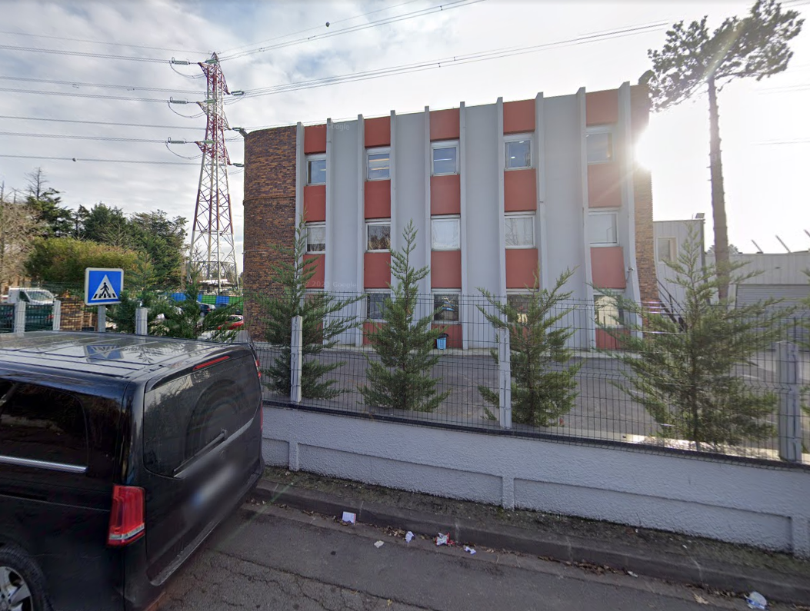 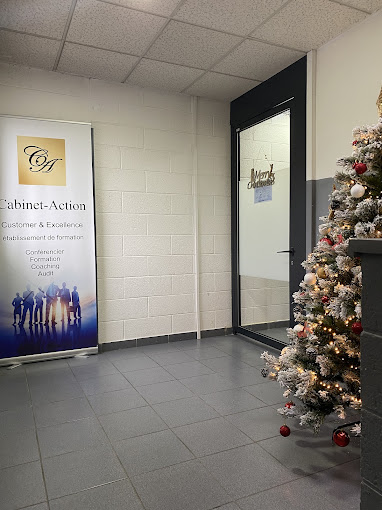 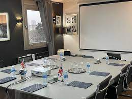 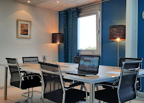
 

   <u>Organisation interne de l'entreprise :</u> Cabinet Action est une PME composée de 11 salariés répartis en 5 services : La direction, les professeurs d'anglais, le chargé d'études, les alternants/stagiaires et l'assistante de gestion.

 

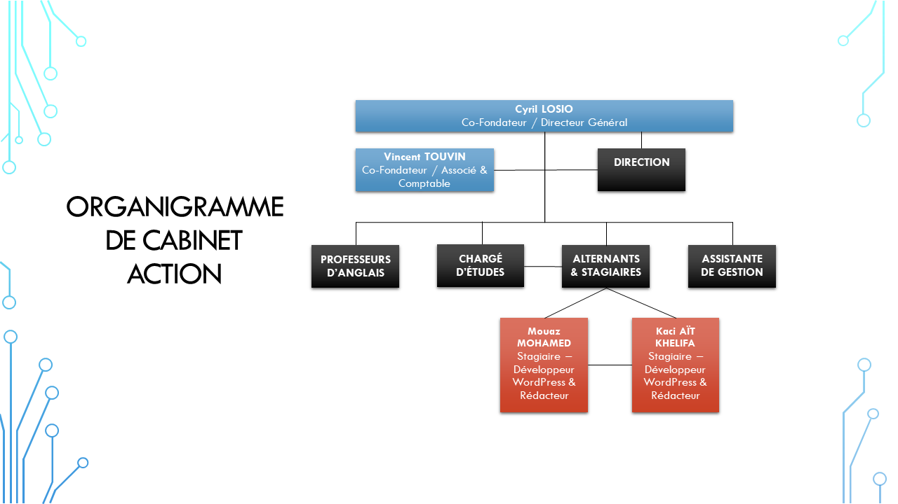

   L'organigramme de Cabinet Action correspond à une structure en soleil, permettant ainsi à la direction d'avoir le contrôle total dans l'ensemble, d'être en lien étroit avec tous les acteurs internes et externes de l'entreprise et d'être en contact direct avec les salariés.

   <u>Analyse du marché :</u> <strong>L’entreprise travaille avec 2 types de clients :</strong>

- Ses principaux __clients particuliers__ (âge attractif de 18 à 50 ans) qui désirent approfondir leur compétences en anglais pour d'éventuelles activités professionnelles.
- Ses principaux __clients professionnels__ qui optent généralement pour des campagnes publicitaires, du management ou bien pour pouvoir former leurs salariés dans diverses formations (restaurants, fast-food, agence de nettoyage, etc).
 

<u>Analyse du Chiffre d'Affaire :</u> Le Chiffre d'Affaires de l’entreprise n‘a cessé d’augmenter avec un taux d’évolution positif, qui a fait chuter la trésorerie de l’entreprise en 2020 jusqu'en 2022, lors de la crise sanitaire du Covid-19.

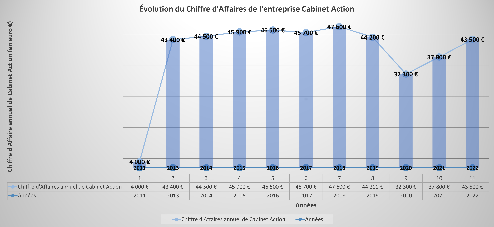

<u>Forces et faiblesses de l'entreprise :</u>
|Forces|Faiblesses|
|---|---|
|Spécialisée dans les formations d'anglais|Concurrent : Cercle des Langues|
|Formation éligible au CPF (Compte Personnel de Formation)|Site Web avec un mauvais référencement|
|Pérennité de l'entreprise|L'entreprise n'a pas de PGI (Progiciel de Gestion Intégré)|
|Locaux et salles aménagés|Non présent sur tous les réseaux sociaux|
|Mise à jour régulière du site Web de l'entreprise|E-Mail frauduleux pour au moins 2 fois par semaine|
|Équilibre stable entre les formateurs|Mauvais tri des documents sur le serveur de l'entreprise|
|Présent sur Facebook|Mauvaise connexion à Internet|
|Diversification par rapport à son concurrent|Panne du serveur de l'entreprise de façon récurrente|
 

---

 
<h3 align = center>PARTIE 3 : MISSIONS RÉALISÉES</h3>
Durant mon stage, mes tâches principales étaient de rédiger des articles adaptés aux clients de Cabinet Action avec ChatGPT, de créer des maquettes de pages Web avec PowerPoint correspondant à ces articles, de développer ces pages Web avec WordPress et Elementor, de référencer les pages Web avec Yoast SEO, puis de les trier par rubrique. 

#### Rédaction d'articles adaptées aux clients avec ChatGPT
Ces articles avaient pour objectif d'informer et d'intéresser les lecteurs sur des sujets liés à leur formation en anglais. Pour chaque article, y compris les cours d'anglais, j'ai demandé à ChatGPT en utilisant des mots-clés assez précises. Par la suite, je récupère la réponse de ChatGPT, je vérifie, j'organise la réponse de manière claire et cohérente en veillant à ce que la structure de l'article soit facile à lire et à comprendre pour tout le monde, tout en respectant les consignes éditoriales et les exigences de Cabinet Action, puis je me fais valider par le directeur ou par mes collègues.
  

#### Création de maquettes de pages Web avec PowerPoint
Après la validation par le directeur ou par mes collègues des articles rédigés, je crée des maquettes de pages Web correspondant à ces articles avec PowerPoint en respectant les consignes du directeur et des collègues concernant la disposition, les images à utiliser ou encore les couleurs utilisées pour chacun des articles par exemple, puis je me fais valider par le directeur ou par mes collègues.
  
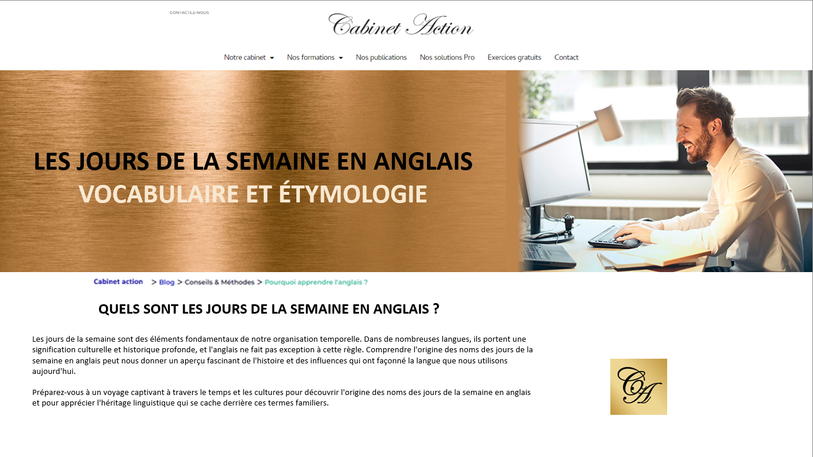 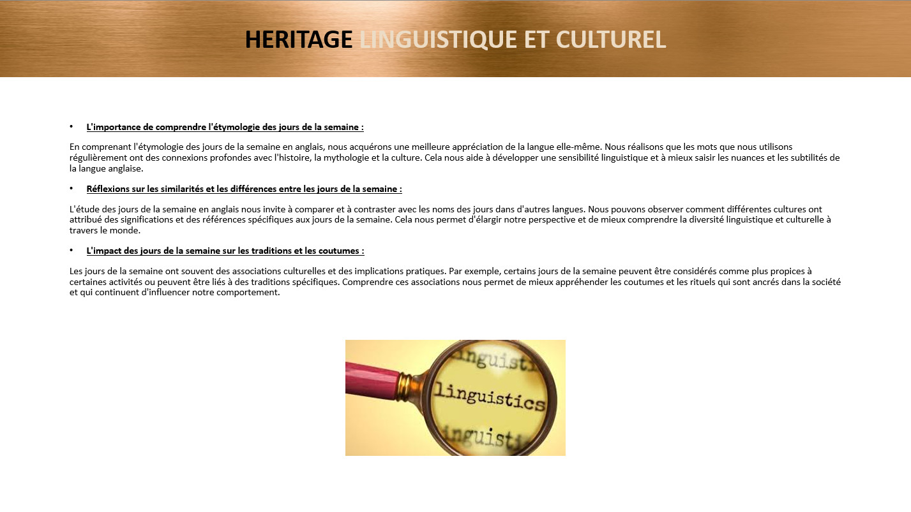
  

#### Développement des pages Web avec l'extension Elementor dans WordPress
Après la validation par le directeur ou par mes collègues des maquettes créées, je développe des pages Web avec l'extension Elementor dans WordPress en utilisant ces maquettes, puis de les publier sur Internet après validation par le directeur ou par mes collègues.
  
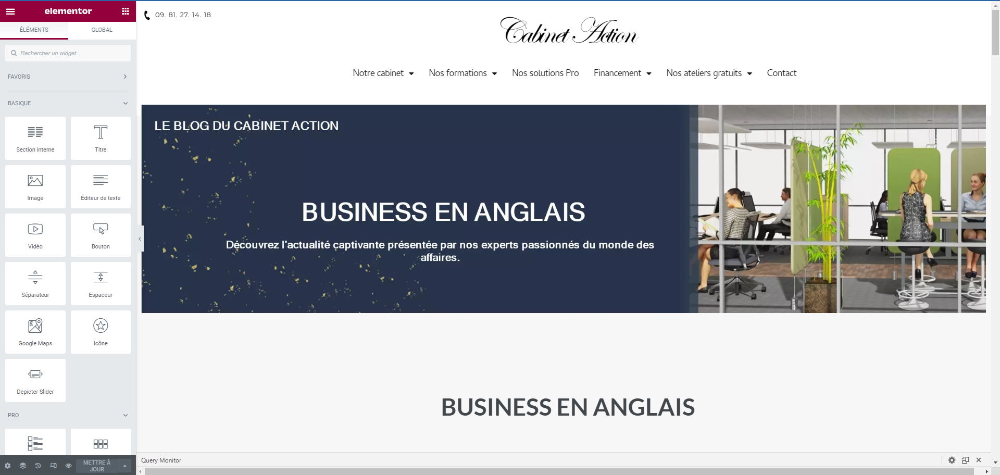
  

#### Référencement des pages Web développés avec l'extension Yoast SEO
Après la publication des pages Web sur Internet, je fais en sorte de mieux les référencer sur le moteur de Google à l'aide de l'extension Yoast SEO qui explique les choses à faire pour le référencement sur Google comme l'utilisation de la requête ciblée (ce que les internautes vont écrire comme mots-clés sur la barre de recherche Google) ou encore d'écrire une bonne méta description afin d'attirer les internautes sur Google.
  
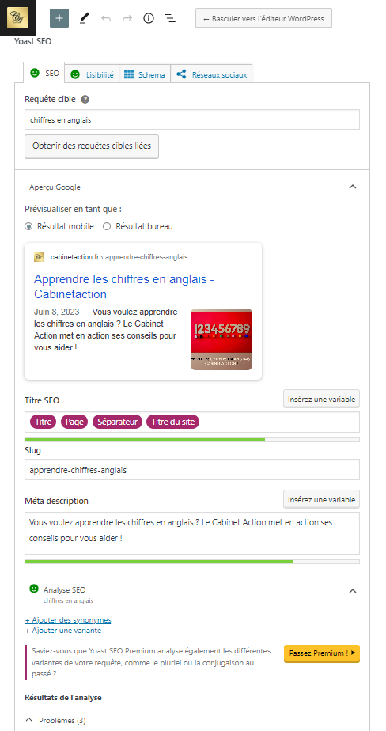 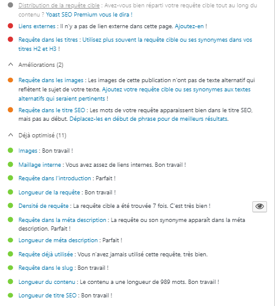
  

#### Tri et organisation des pages Web dans des rubriques sur le site Web
Après le référencement des pages Web, je dois les trier et les organiser dans des rubriques afin que les pages Web soient organisées et structurées pour les internautes, tout en insérant des images et des descriptions afin d'attirer les internautes.
 
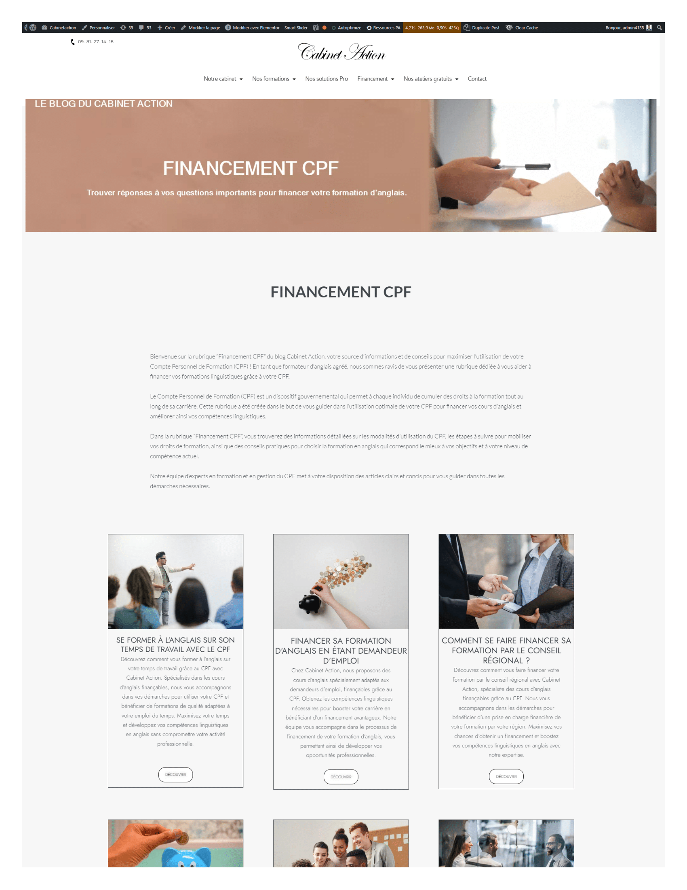 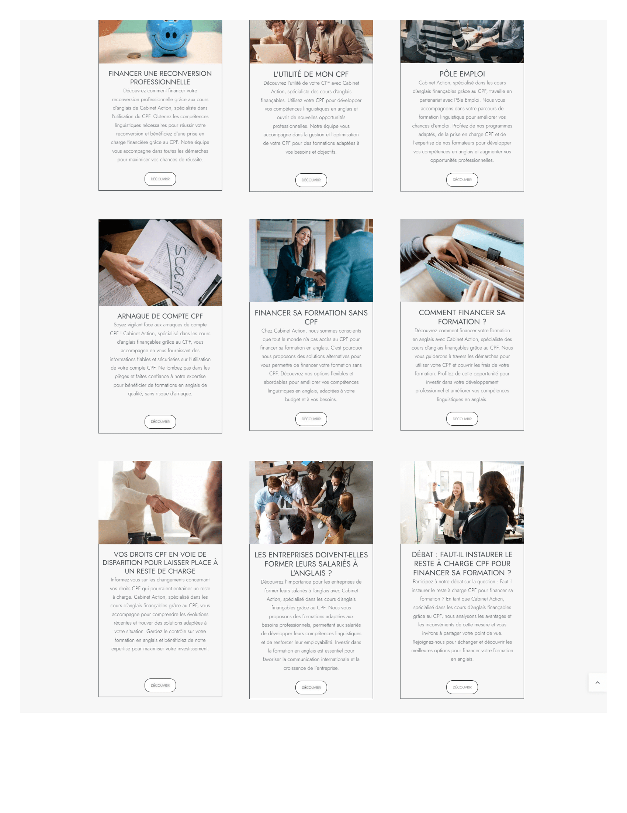

#### Branchement, installation et configuration de PC Windows 11
J'ai été amené à brancher trois nouvelles unités centrales HP sans système d'exploitation dans les locaux de Cabinet Action (câble d'alimentation, câble Ethernet, câble HDMI vers l'écran & périphériques d'entrée comme la souris et le clavier). Par la suite, sur un PC utilisable, je dois installer et créer le support d'installation bootable de Windows 11 sur une clé USB vierge de 8 Go. Lorsque l'installation est terminée, j'insère la clé USB Windows 11 sur chacun des trois nouvelles unités centrales HP en installant et en configurant Windows 11 afin qu'elles soient prêtes à l'emploi.
  

#### Démontage et remplacement de l'écran LCD et du rétroéclairage LCD d'un moniteur ASUS MX279H
Le directeur avait deux moniteurs ASUS MX279H : Parmi les deux, il y en a un dont l'écran LCD ne fonctionne plus et l'autre dont le rétroéclairage LCD ne fonctionne plus. Donc, moi et mon collègue nous étions amenés à démonter les deux moniteurs, retirer le rétroéclairage LCD qui est fonctionnel dans le moniteur où l'écran LCD est défaillant, de le remplacer par le rétroéclairage LCD défaillant dans l'autre moniteur où l'écran LCD est fonctionnel, de reconnecter tous les câbles et fils à la carte mère du moniteur, puis d'assembler tout le reste afin que le moniteur final soit opérationnel.
  
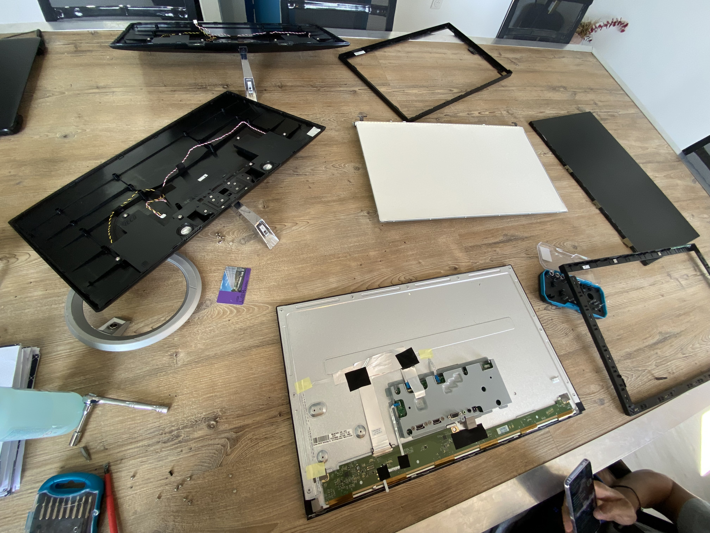 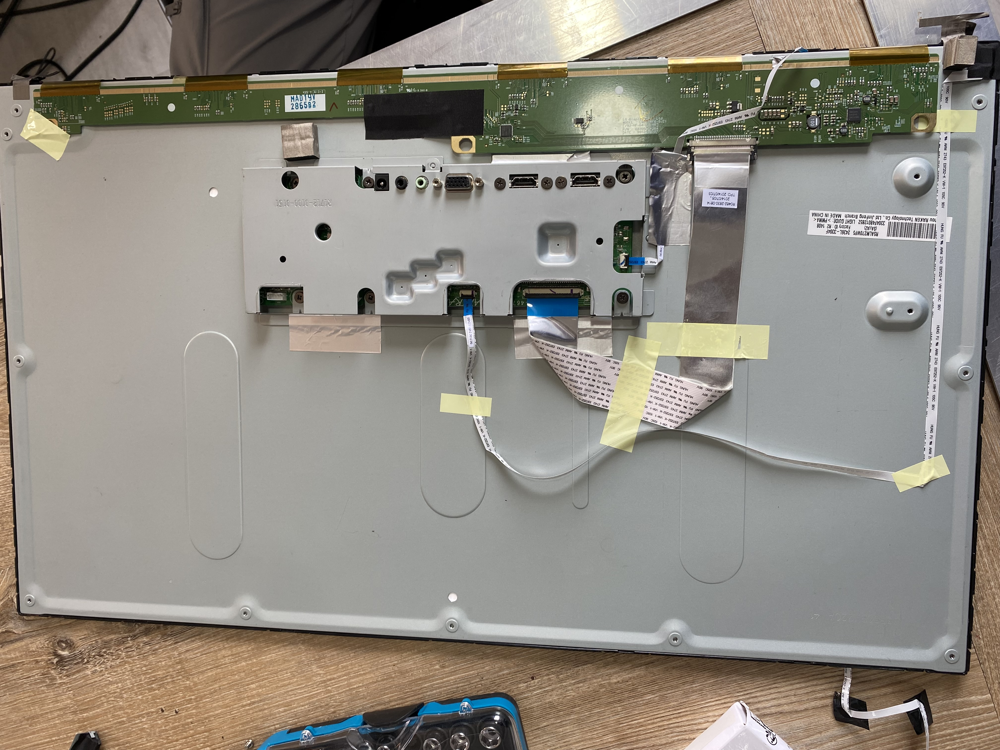 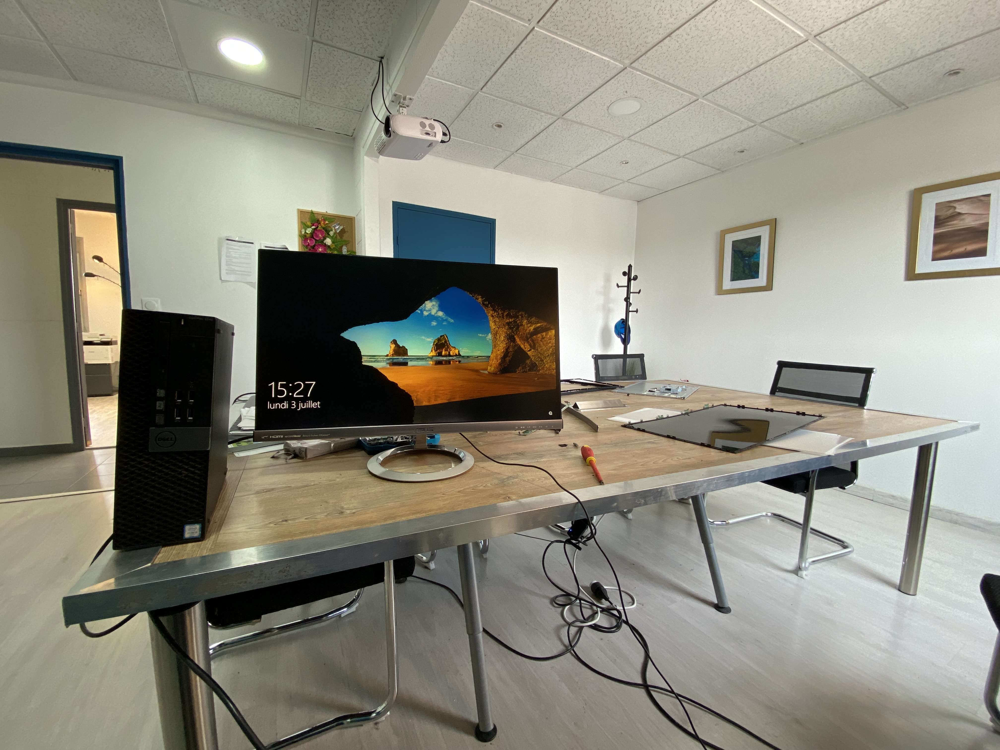
  

---

<h3 align = center>PARTIE 4 : CONCLUSION</h3>
Ce stage en fin de première année de BTS SIO option SLAM chez Cabinet Action a été une expérience enrichissante à la fois sur le plan professionnel et personnel. J'ai eu l'opportunité de découvrir le fonctionnement d'une PME et de m'immerger dans le monde de l'entreprise. Cette expérience m'a permis de développer mes compétences sur WordPress, le référencement, la réparation, le branchement, l'installation et la configuration de PC Windows 11, la communication écrite, la créativité et sur l'adaptation à travers toutes les tâches réalisées durant tout ce stage. J'ai également appris l'importance du travail en équipe au sein de l'entreprise. Ce stage m'a également permis d'améliorer mon autonomie, ma rigueur, mon organisation et ma gestion du temps. Je suis reconnaissant envers toute l'équipe de Cabinet Action qui m'ont accompagné tout au long de ce stage. Ce stage m'a donné un aperçu concret du monde professionnel et m'a préparé à relever de nouveaux défis avec confiance et détermination.